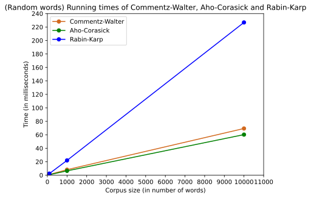
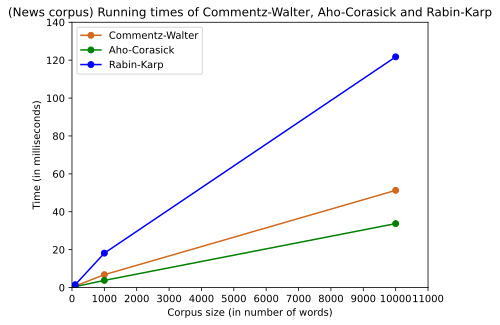
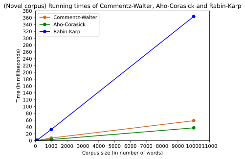
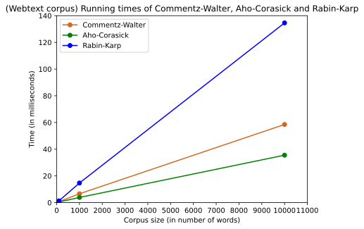

# Multi Pattern String Matching Algorithms

## Introduction
In our project, we aim to carry out worst-case analyses of various multi-pattern string matching
algorithms by implementing and running them on various input instances. For our problem statement,

We consider a synonym-inclusive string search: given a search query and a corpus to search in, we
search for occurrences of each word in the search query with its synonyms from a dataset like
WordNet. We can then observe how the performance of state-of-the-art multi-pattern string matching
algorithms compares against their theoretical guarantees.


For this,  we  chose  three  state  of  the  art  algorithms  to  study,  analyze,  implement,  and  compare.Each algorithm is implemented in Python.  The three algorithms under consideration are:
1.  Aho-Corasick algorithm (an extension of Knuth-Morris-Pratt algorithm)
2.  Commentz-Walter algorithm (an extension of Boyer-Moore algorithm)
3.  Rabin-Karp algorithm
## Running the project locally
### Installing requirements
#### Using poetry
Install [poetry](https://python-poetry.org/docs/#installation) which is a tool for dependency management and packaging in Python
```bash
poetry install
```
#### Using pip
You can also install dependencies to your python environment
```bash
pip install -r requirements.txt
```
### Run algorithms
 ```main.py``` bench marks Rabin Karp, Commentz Walter, Aho Corasick using corpus from [Wordnet, Webtext, Gutenberg, News](http://www.nltk.org/nltk_data/) that is downloadable with the [nltk library](https://www.nltk.org/).

#### Using poetry

```bash
poetry run python main.py
```
#### Using your venv
```bash
python main.py
```
### Run unit tests
Unit tests, check if each of the algorithm returns the right matches with the search string and patterns provided to it
#### Using poetry
```bash
poetry run python -m unittest
```
#### Using pip
```bash
python -m unittest
```

## Results







